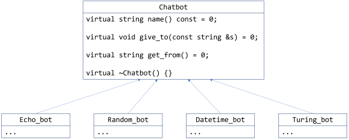

# Assignment 3: Chatbots

> In endless loops of chat and lore,
> It ponders life, algorithms, and more.
> A bard in a box, a cybernetic sage,
> Dancing on the keyboard, a virtual stage.
>
> -- ChatGPT, asked to write a poem about chatbots

In this assignment your task is to implement and test a number of different
chatbots. While they won't be as smart as ChatGPT, they will help you understand
object-oriented programming.

## Getting Started
Put all the code you write for this assignment into [a3.cpp](a3.cpp).

[a3.cpp](a3.cpp) includes [Chatbot.h](Chatbot.h), which has the `Chatbot` base
class that your classes must publicly inherit from. All the methods in
[Chatbot.h](Chatbot.h) are virtual and abstract, and your inheriting classes
should implement all of them in a sensible way. We want to see you use good
programming style and make use of C++'s object-oriented features.

[Chatbot.h](Chatbot.h) has a helper function called `converse` that you can, if
you like, use to help develop test your chatbots. You are free to use, modify,
or ignore `converse` as you see fit.

**Important** For each chatbot, make sure to implement the constructors
*exactly* as given in the examples and description. Otherwise, your code might
not compile with the marking scripts!

Make sure to thoroughly test all your chatbots.

Here's a class diagram for the classes in this assignment:



## Using cmpt::error

Some of the questions ask you to "call `cmpt::error` with a helpful message".
`cmpt::error(msg)` is a function in [cmpt_error.h](cmpt_error.h) that, when
called, *intentionally* crashes your program. This helpful when developing your
program: you usually want your program to stop running as soon as it recognizes
an error so that you can debug it.

For example:

```cpp
#include "cmpt_error.h"

string say_hi(const string& name) 
{
    if (name == "")
    {
        cmpt::error("say_hi: name is empty!");
    }
    return "Hello, " + name + "!";
}
```

If you call `say_hi("")` then `cmpt::error` crashes the program.


## Chatbot 1: Echoed Replies

Implement a chatbot class (that inherits from `Chatbot`) called `Echo_bot` that
always replies with the *last* string that it was given to it. If it needs to
speak before being given a string, then it returns a special "first reply"
string provided in the constructor.

For example:

```cpp
Echo_bot ebot("repeato", "repeato is ready to go!");
```

The name of `ebot` is `repeato`, and if it is asked to speak first, it will say
`"repeato is ready to go!"`.

## Chatting with the User

The `converse` function in [Chatbot.h](Chatbot.h) lets two chatbots talk to each
other. For example, calling `converse(&ebot, &ebot, 3)` prints this rather
boring conversation:

```
Conversation between repeato and repeato, 3 turns

repeato 1> repeato is ready to go!
repeato 1> repeato is ready to go!

repeato 2> repeato is ready to go!
repeato 2> repeato is ready to go!

repeato 3> repeato is ready to go!
repeato 3> repeato is ready to go!

Conversation ended: max=3 turns reached
```

We'd also like for the user to talk with chatbots during testing and
development. So, implement these functions (not methods!) in [a3.cpp](a3.cpp):

```cpp
//
// User conversation with bot. User goes first.
// Ends when the user types the string "!done".
//
void converse_with_user_first(Chatbot* bot);

//
// User conversation with bot. The bot goes first.
// Ends when the user types the string "!done".
//
void converse_with_user_second(Chatbot* bot);
```

Here is an example when calling `converse_with_user_first(&ebot)`:

```
Conversation with repeato (type !done to quit)

User 1> Hello!
repeato 1> Hello!

User 2> Goodbye!
repeato 2> Goodbye!

User 3> !done
repeato 3> !done

User conversation with repeato ended
```

And when calling `converse_with_user_second(&ebot)`:

```
Conversation with repeato (type !done to quit)

repeato 1> repeato is ready to go!
User 1> Hello!

repeato 2> Hello!
User 2> Goodbye!

repeato 3> Goodbye!
User 3> !done

User conversation with repeato ended
```

Please format the output as in the examples:
- Print a message at the top when the conversation starts that says the names of
  the chatbots.
- For each line, print the speakers name and the turn number, followed by a `>`.
- Then print the speaker's message.
- The conversation stops when the user types "!done". There is *no* max turn
  limit.
- When the conversation ends, print a message saying so.

## Chatbot 2: Random Replies

Implement a chatbot class (that inherits from `Chatbot`) called `Random_bot`
that chooses a random reply from a vector of given replies.

### A vector<string> of Replies

`Random_bot` has a constructor that takes a `vector<string>` as its second
parameter (the first parameter is the name of the chatbot). If the passed-in
vector is empty, call `cmpt::error` in the constructor with a helpful message.

For example:

```cpp
Random_bot cat{"Mittens", {"meow", "purrr", "meeeeow"}};
```

Calling `cat.get_from()` returns `"meow"`, `"purrr"`, or `"meeeeow"` at random.

### Replies from a Text File

`Random_bot` also has a constructor that takes a `string` for the name of a file
as its second parameter (the first parameter is the name of the chatbot). You
can assume the file is non-empty, and that each line is one reply. If the file
can't be opened then call `cmpt::error` in the constructor with a helpful
message.

For example, suppose the text file `dog_sounds.txt` contains this:

```
woof
ruff
yap yap yap
bow wow  
```

Then we can construct a random reply bot like this:

```cpp
Random_bot dog{"Fido", "dog_sounds.txt"};
```

Calling `dog.get_from()` returns `"woof"`, `"ruff"`, `"yap yap yap"`, 
or `"bow wow"` at random.

## Chatbot 3: Current Time and Date

Implement a chatbot class (that inherits from `Chatbot`) called `Datetime_bot`
that replies with the current date and time just when the last string told to it
contains either "date" or "time" (or both) as a substring. The rules for how it
works are as follows:

- If just "date" appears one or more times as a substring in the last string
  told to the bot, then the reply is the current date in the format
  *year*-*mm*-*dd*, where *year* is the year, *mm* is the two-digit code for the
  month (January=01, February=02, ..., December=12), and *dd* is the two-digit
  code for the day of the month (01, 02, 03, ..., 29, 30). For example,
  "2022-02-22" is February 2, 2022.
- If just "time" appears one or more times as a substring in the last string
  told to the bot, then the reply is the current time in this 24-hour format:
  "The current time is 17:23:53".
- If *both* "date" and "time" each appear one or more times as substrings in the
  last string told to the bot, then the reply is the current date and time in
  this format: "Today is 2024-01-31 and the current time is 17:23:56."
- If neither "date" nor "time" appears in the last string given to the bot, then
  the reply is "Ask me about the date or time!".

When checking for "date" or "time", the case **does not matter**, e.g. if the
last string told to the bot was "what's the dAtE???", then that counts as
containing "date".

Example:

```cpp
Datetime_bot dt_bot("deetee");
```


## Chatbot 4: Turing Bot

`The Turing Test <https://en.wikipedia.org/wiki/Turing_test>`_ is a famous
thought experiment that some people believe can determine if a program is
intelligent. It works by having the program and a human (who we assume is
intelligent) hold a text-only conversation using a chatbot-like interface. If
the program can fool the human into thinking it's a real person, then, some say,
the program must have human-like intelligence.

In the spirit of the Turing Test, implement an **original** and interesting
chatbot class called `Turing_bot` that tries to pass the Turing test. Make it is
as smart and feature-rich as you can. It's okay if your chatbot is restricted to
one particular topic, as long as it is interesting and tries to be intelligent
in some way. You can expand upon ideas from the previous bots, or try something
new.

Please make something original and interesting, something that you would be
proud to show off to others. **Do a little bit of research on the web to get
ideas for other kinds of chatbots**.

In the source code comments for this chatbot, please include some description of
the techniques your chatbot uses, and provide links for any research you did or
help you received.

Your `Turing_bot` should be constructed like this:

```cpp
Turing_bot smart_bot("Alan");
```

**Important note**: You can only #include the files are already included in
[a3.cpp](a3.cpp).

## Submit Your Work

Please put all your code into [a3.cpp](a3.cpp), and submit it on Canvas.
Implement **all** the constructors, methods, and functions exactly as described,
otherwise the marking software will probably give you 0!

The only file you submit is [a3.cpp](a3.cpp): *don't* submit any other files.
The marker will use the standard [makefile](makefile) to compile it, and a copy
of [cmpt_error.h](cmpt_error.h) and `Chatbot.h` will be in the same folder as
your [a3.cpp](a3.cpp) when it's tested.

## Basic Requirements

Before we give your program any marks, it must compile on Ubuntu Linux using the
standard course [makefile](makefile):
  
```
$ make a2
g++  -std=c++17 -Wall -Wextra -Werror -Wfatal-errors -Wno-sign-compare -Wnon-virtual-dtor -g   a2.cpp   -o a2
```
  
If your program fails to compile, your mark for this assignment will be 0.

## Marking Scheme

### Chatbot 1: Echoed Replies

**2 marks** for a complete and correct chatbot that works as described.


### Chatbot 2: Random Replies

**4 marks** for a complete and correct chatbot that works as described. This
includes both constructors.


### Chatbot 3: Date and Time

**4 marks** for a complete and correct chatbot that works as described with
"date" and "time" substrings.

**1 mark** for correctly ignoring the case of "date" and "time".

### User Conversation Functions

**2 mark** for a complete and correct `converse_with_user_first`.
**2 mark** for a complete and correct `converse_with_user_second`.


### Chatbot 4: Turing Bot

**4 marks** for an *interesting and original* chatbot. It should have as many
features as possible, e.g. at the very least as many features as chatbot 1 to 3
combined. Obviously low-effort chatbots will not get full marks.

**1 mark** for describing techniques the chatbot uses, and links to web
research.

### **Overall source code readability: 5 marks**
- All code is sensibly and consistently indented, and all lines are 100
  characters in length, or less.
- Whitespace is used to group related pieces of a code to make it easier for
  humans to read. All whitespace should have a purpose.
- Variable and function names are self-descriptive.
- Appropriate features of C++ are used, as discussed in class and in the notes.
  **Note** If you use a feature that we haven't discussed in class, **you must
  explain it in a comment**, even if you think it's obvious.
- Comments are used when needed to explain chunks of code whose purpose is not
  obvious from the code itself. There should be *no* commented-out code from
  previous versions.

### Deductions
- **-1 mark** (at least) if your file does not have the correct name, or you
  submit it in the incorrect format.
- up to **-3 marks** if you do not include your full name, email, and SFU ID in
  the header of your file.
- **A score of 0** if one or more of the following are true:
  - You *don't* include the "Statement of Originality", or it is modified in any
    way.
  - You use code from some other source (e.g. the web, the textbook, ChatGPT, a
    friend, a teacher, a TA...) *without* citing the source.
  - You submit a "wrong" or non-working file, and then *after the due date*
    submit the "right" file. If you can provide evidence that you finished the
    assignment on time, then it may be marked.
- **-5 marks** for any *memory leaks*, or other errors, reported by `valgrind`.
  `valgrind` is run like this:

  ```console
  > valgrind ./some_prog
    
  // ... lots of output ... 
  ```

  A program is considered to have **no memory leaks** if:

  - In the `LEAK SUMMARY`, `definitely lost`, `indirectly lost`, and
    `possibly lost` are all 0.
  - `ERROR SUMMARY` reports 0 errors.
  
  If `valgrind` reports any errors for a run of your program, your assignment
  will get a deduction as described below.

  **Note** It *may* be okay if **still reachable** reports a non-zero number of
  bytes. It often means that some memory was not de-allocated when your program
  finished. That could be because you forgot to de-allocate the memory, or, it
  *might* be that the compiler optimized-away the de-allocation in cases where
  it can prove the program will immediately end (the operating system will clean
  up any memory a finished program hasn't de-allocated). **Rule of thumb**:
  assume that **still reachable** means you have forgotten a `delete` statement
  somewhere. Carefully check that you haven't left out any `delete` statements
  before concluding that it is due to a compiler optimization.
  
There may be other deductions, depending upon the circumstances.
